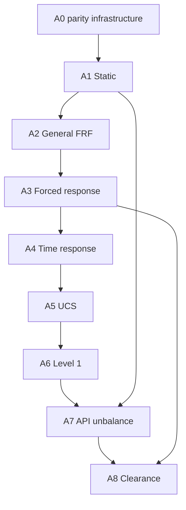

# ROSS expansion — pre-implementation audit (2026-09-27)

## Baseline and evidence

GitHub API and cloned repositories agree:
- RotorStudio main: `e2a8b57003edf4b407ea089e92160ce86b30c35c`.
- ROSS main and frozen authority: `6320eab9f890f1b3cc1710d508b446fe063ca68d`.
- RotorStudio delta to requested baseline: empty. ROSS delta: empty.
- No AGENTS.md in RotorStudio tree; ROSS AGENTS.md read.
- No production code changed by A0. Existing qualification documents are historical
  evidence, not evidence that the new A0 commit passed CI.

## Reusable Fortran inventory

- `rd_assembly_rotating.f90`: assemble_rotor_rotating, assemble_bearings_rotating
- `rd_assembly_stationary.f90`: assemble_rotor, assemble_bearings
- `rd_c_api.f90`: rd_modal_legacy,rd_modal_legacy_vectors,rd_assemble_legacy,rd_bearings_legacy,rd_freq_rsp_legacy,rd_crit_spd_legacy,rd_crit_spd_legacy_ex, rd_freq_aux_legacy,rd_freq_fdn_legacy,rd_time_fdn_legacy,rd_runup_legacy,rd_runup_coeffmap_legacy, rd_element_circular_legacy,rd_element_tapered_legacy,rd_element_asymmetric_legacy, rd_coax_modal_legacy,rd_coax_freq_rsp_legacy,rd_asym_assemble_legacy,rd_bearasym_legacy,rd_asym_modal_legacy,rd_asym_freq_rsp_legacy,rd_version
- `rd_coaxial_solver.f90`: coaxial_eigs,coaxial_frequency_response
- `rd_critical_speed.f90`: critical_speeds,critical_speeds_ex
- `rd_dp45.f90`: dp45_time_fdn_grid, dp45_runup_span, dp45_runup_coeffmap_span
- `rd_eigensystem.f90`: stationary_eigs, second_order_eigs, matlab_complex_sort, matlab_complex_sort_vectors
- `rd_external_response.f90`: auxiliary_frequency_response, foundation_frequency_response
- `rd_frequency_response.f90`: 
- `rd_kinds.f90`: 
- `rd_lapack.f90`: solve_real, solve_complex, eig_real, eig_complex, generalized_eig_real
- `rd_reduction.f90`: modal_truncation
- `rd_rotating_solver.f90`: asymmetric_eigs,asymmetric_frequency_response
- `rd_shaft_asymmetric.f90`: 
- `rd_shaft_circular.f90`: shaft_circular_matrices
- `rd_shaft_tapered.f90`: shaft_tapered_matrices
- `rd_status.f90`: 
- `rd_transient.f90`: time_foundation_response,runup_response,runup_coeffmap_response

Use `rd_lapack.solve_real` (DGESV) for static solves. Reuse assembly only after
matrix comparison for the declared subset. In particular circular shaft shear
coefficient must not be assumed identical to the ROSS default. A0 cases disable
shear and rotary inertia explicitly; this is a declared reference subset, not
qualification of general Timoshenko or tapered static analysis.

## Existing rotor C ABI

- `rd_version`
- `rd_element_circular_legacy`
- `rd_element_tapered_legacy`
- `rd_element_asymmetric_legacy`
- `rd_bearings_legacy`
- `rd_assemble_legacy`
- `rd_modal_legacy`
- `rd_modal_legacy_vectors`
- `rd_freq_rsp_legacy`
- `rd_freq_aux_legacy`
- `rd_freq_fdn_legacy`
- `rd_time_fdn_legacy`
- `rd_runup_legacy`
- `rd_runup_coeffmap_legacy`
- `rd_crit_spd_legacy`
- `rd_crit_spd_legacy_ex`
- `rd_coax_modal_legacy`
- `rd_coax_freq_rsp_legacy`
- `rd_asym_assemble_legacy`
- `rd_bearasym_legacy`
- `rd_asym_modal_legacy`
- `rd_asym_freq_rsp_legacy`

The independent `fortran/bearings/src/rb_c_api.f90` library remains unchanged.
Boundary layouts and signatures in rd_c_api.f90 remain authoritative. Add a
versioned static symbol, not a change to legacy entry points.

## AnalysisService inventory

`python/src/drm_core/analysis/service.py` and `domain/analysis_cases.py` reexport
from `drm_core.stage1`. AnalysisCase is a free string plus parameter/options maps.
Actual dispatch in stage1.py supports modal, modal_sweep, frequency_response,
auxiliary_frequency_response, foundation_frequency_response, critical_speeds,
coaxial_modal, coaxial_frequency_response, asymmetric_modal,
asymmetric_frequency_response, foundation_time_response, runup and bearing_matrices.
It validates project readiness, records model/analysis hashes, attaches metadata,
and supports persistence through save_project/load_project. Static is absent.
SolverFacade delegates to FortranBackend. A1 must add a thin path through both;
adding only a file in analysis/ would not integrate the service.

## Phase 1 authority inventory

All methods below are in `ross/rotor_assembly.py` at the frozen SHA.

| Feature | Method and supporting sources | Important semantics |
|---|---|---|
| A1 | run_static; gravitational_force; utils.remove_dofs; results.StaticResults | seals excluded; housing bearings removed; supports replaced by 1e20; g=-9.8065; lateral reduction |
| A2 | run_freq_response; _run_freq_response; transfer_matrix | fixed spin is distinct from excitation; displacement/velocity/acceleration |
| A3 | run_forced_response; results.ForcedResponseResults | arbitrary complex DOF force vector |
| A4 | run_time_response; time_response; utils.newmark | force history, integration semantics and initial state need dedicated audit |
| A5 | run_ucs; utils.intersection; convert_6dof_to_4dof | remove shaft damping and seals; stiffness log sweep; intersections |
| A6 | run_level1; results.ModalResults | cross-coupled stiffness; exclude backward modes |
| A7 | api617_unbalance; results.Shape/Orbit | static loads, whirl, lobes and antinodes |
| A8 | run_clearance_analysis; results | A3 + A7 + orbit major axis and probe units |

Supporting element authorities: shaft_element.py, disk_element.py,
bearing_seal_element.py, point_mass.py and materials.py. Their tracked hashes are
recorded by the generator together with the complete tracked ross source tree.

## Dependency graph

These arrows include the mandated delivery order; A4 does not mathematically
require A3. Later gates: Phase 1 → B1 element matrices → B2 assembly → B3 workflows;
A4+B1+B2 → faults/HB; deterministic solvers → stochastic;
B2 → two-rotor linear → TVMS → backlash; platform + controller states → AMB → sensitivity.

## Architectural risks

1. Static support semantics are rigid replacement, not the normal bearing K at
   zero speed. Evaluating hydrodynamic bearings at zero speed can fail physically.
2. Housing links, point masses, repeated bearings at one node, seals-only models,
   tapered shafts and multiple shafts require explicit mapping or fail-closed scope.
3. Gravity is a consistent mass load, including rotational entries; lumping shaft
   weight only at translations can produce wrong deformation.
4. ROSS diagrams use repeated element end stations, with special last-element
   treatment. Reconstructing smooth diagrams would change observable results.
5. The 1e20 support penalty is ill-conditioned. Compare free DOFs and reactions,
   residual scaled by matrix/solution norms, and independent force/moment balance.
6. Source-derived legacy shaft models are not automatically ROSS matrix parity.
   Never modify their qualified formulas to force new golden agreement.
7. UI release needs result persistence/export and frozen Linux/Windows gates;
   reference generation alone must never enable a menu item.
8. ROSS runtime dependency belongs to validation only; no Python fallback physics.

## Proposed A0 files and acceptance

validation/ross_parity: generator, verifier, tests, static JSON/NPZ, authority.json;
docs: this audit, AUTHORITY map and ROADMAP; CI: independent Linux/Windows
reference reproduction. Future feature directories remain reserved, not stubs
claiming implementation.

A0 acceptance: exact source SHA + clean checkout + imported-source identity;
tracked source hashes; environment/version/timestamp; immutable golden generation;
all finite outputs; corruption and missing-file rejection; strict shapes and keys;
independent equilibrium; two fresh ROSS generations numerically reproducible;
Linux and Windows CI at the same PR head, plus applicable existing regressions.
No feature is released by A0. A1 starts only after these mandatory gates pass.

## Proposed A1 files and acceptance

- fortran/src/rd_static.f90: gravity, solve, reactions, diagram recovery.
- fortran/src/rd_c_api.f90: additive rd_static_v1 with dimensions, status and buffers.
- fortran/CMakeLists.txt; fortran/tests/test_static.f90.
- python/src/drm_core/solver/{ffi,backend,facade}.py: thin native call.
- python/src/drm_core/analysis/static.py; results/static.py; stage1.py dispatch.
- python tests: ABI, wrapper, service, persistence, unsupported inputs.
- GUI setup/results only after numerical parity; dedicated frozen smoke.
- docs/ROSS_STATIC_FORTRAN_IMPLEMENTATION.md and A1 CI.

A1 acceptance: native K/F unit checks; matrix/DOF parity for declared element
scope; sum F and sum M; scaled Kq-F residual; deformation/reaction/shear/moment
parity; finite and invalid-input checks; ABI without GUI; Python and service;
save/reopen/recompute; GUI; Release+CTest; inherited regression gates;
frozen Linux and Windows at same SHA. Initial static rtol 1e-8 is provisional
until conditioning and platform evidence justify quantity-specific atol.

## Current verdict

A0_ROSS_PARITY_INFRASTRUCTURE = PASS at implementation SHA
`f07dc86b62652bb92cc3d2e0af20c972fec0b67e`. All mandatory workflows and
platform aggregates were revalidated SUCCESS. See ROSS_ANALYSIS_A0_QUALIFICATION.md.
The documentation closure commit requires fresh same-HEAD gates before promotion.
A1 is next after A0 promotion to main; no static solver implementation claimed.
A2 and all later features: BLOCKED by delivery order.
Local toolchain installation failed (APT setgroups/seteuid restrictions).
No workaround changes to production or permissions were made.
