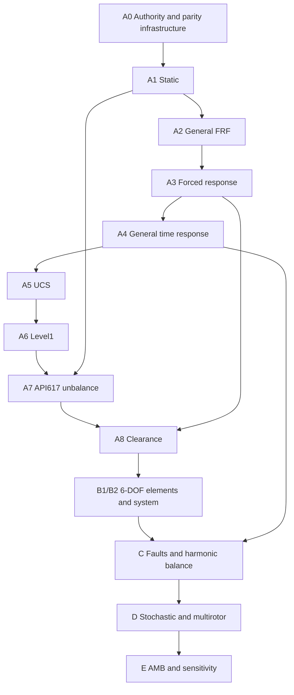

# Incremental Fortran analysis expansion

This is a dependency plan, not a feature availability declaration. Production
physics stays in Fortran 2018; Python owns orchestration/domain/units/results.

Arrows include mandatory delivery order as well as numerical prerequisites.
Within D: deterministic samples -> two-rotor constant mesh -> TVMS -> backlash.
Within E: controller/actuator/sensor states -> coupled AMB response -> sensitivity.

Current implementation scope is A0. A1 awaits A0 qualification and reviewed
frozen reference data. No automatic advance to A2. Each feature receives its
own PR, provenance, native/ABI/integration/golden/physics tests, release gates
and explicit PASS, FAIL or BLOCKED verdict. No changing prior production
physics, no Python numerical fallback, and no automatic golden refresh.

See ROSS_ANALYSIS_EXPANSION_AUTHORITY.md for actual inventories and A0/A1
acceptance criteria. Later phases retain the user-requested gate sequence;
their source details must be audited before implementation rather than assumed.
